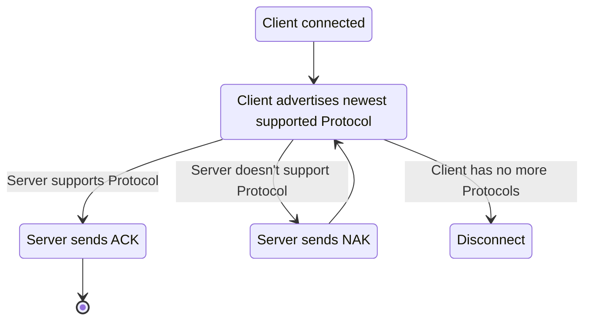
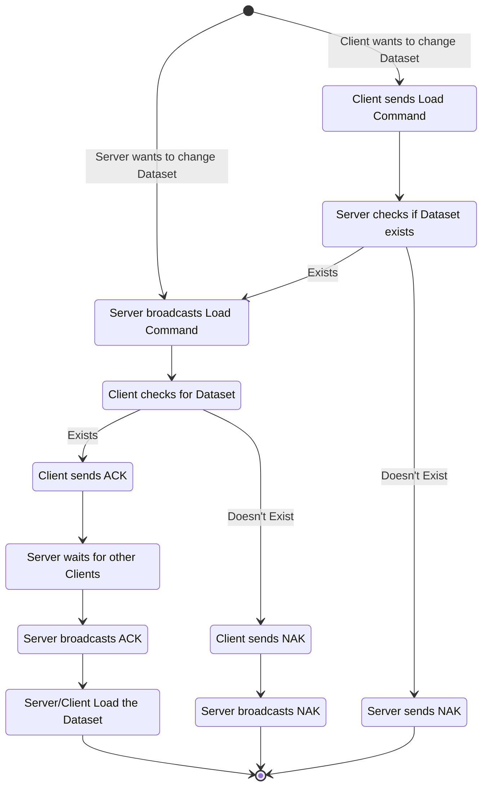

# WebSocket Server Protocol V1

Through WebSockets external applications are able to communicate with the openIA server and vice versa. All messages are sent in a binary format. In case Text is transmitted, it will be sent in UTF-8.

The direction of a message is shown atop the byte representation.  
An optional description might be present under the direction.  
All message content is represented as tables with bytes in hex.

This draft was created with the assumption that message lengths are not known.

## Byte Order

If not specified otherwise, values in a column are **8-bit**.  
All bytes are sent in **Big Endian**, because most programming languages, independent of hardware, represent multi-byte types (integer, long, etc.) in Big Endian to the programmer.

Example:  
32-bit integer in hex "0x12345678"
|0x12|0x34|0x56|0x78|
|---|---|---|---|

## Common Messages

Acknowledgement (ACK)
|0x0|
|-|

Negative Acknowledgement (NAK)
|0x1|
|-|

## Protocol Negotiation

The first message is the most important, as it is used to negotiate protocol versions.  
Don't be alarmed by the big messages, as speed is not a priority when connecting a new client.

Protocol negotiation can be displayed by the state diagram below:

A protocol advertisement message looks as follows:  
|0x2|Protocol Version (64-Bit)|
|-|-|

## Client Login

When a Client connects, the Server must assign them an ID. The ID generation algorithm is up to the Server, altought it has to be unique for all currently connected clients.

Server &rarr; Client

|0x3|Client ID (64-bit)|
|-|-|

## Commands

### Reset

Both server and client can send reset commands. If a client sends a reset, the server just broadcasts the command to all the other clients.

|0x4|0x0|
|-|-|

### Load Dataset

When loading a new dataset, its name is required. This command can come from the server and a client but they look the same.

|0x4|0x1|Name Length (32-Bit)|Name (x-Bits)|
|-|-|-|-|

If the server receives a load dataset command, it first checks if the dataset exists on the server. If not it sends a NAK back and stops.  
The command is broadcast to all clients (even the sending one).  
Every client checks if they can load the dataset and sends an ACK back to the server, NAK if not.  
If all clients sent a ACK, the server broadcasts ACK, else NAK.  
Now the clients and the server can start loading the new dataset.

## Objects

> [!WARNING]
> Identifying Objects accross WebSockets is not discussed yet. If we want to generate objects on the fly, we need to send models over the WebSocket. In its current form, the openIA camera, the Unity Tablet, the Slicer and the object itself should have hardcoded IDs.

> [!IMPORTANT]
> All transformation operations currently take **floats**. If **double** operations are needed, we can add them later.

Current List of fixed IDs:
|ID|Object|
|-|-|
|0|Object|
|1|Slicing Plane|

<!---

### Register Object

> [!CAUTION]
> Registering Objects is not complete! Refer to the Warning above for more information!

To interact with an object accross devices, it has to be registered on the server.  
The client sends a packet with a name.

|0x5|0x0|Name Length (32-Bit)|Name (x-Bits)|
|-|-|-|-|

The server responds with an ID. The ID generating algorithm is not specified, but must generate unique IDs for all currently existing objects.

|0x5|0x0|Object ID (64-Bit)|
|-|-|-|

> [!NOTE]
> 0x5 0x1 is currently reserved for deregistering objects.

--->

### Set Matrix of Object

Through setting a matrix, an objects transform, rotation and scale can be set all at the same time.

The matrix is **4x4** containing **32-Bit floats**. It is read from left to right, top to bottom.

Example:
<table>
    <tr><td>0</td><td>1</td><td>2</td><td>3</td></tr>
    <tr><td>4</td><td>5</td><td>6</td><td>7</td></tr>
    <tr><td>8</td><td>9</td><td>10</td><td>11</td></tr>
    <tr><td>12</td><td>13</td><td>14</td><td>15</td></tr>
</table>

|0x5|0x2|Object ID (64-Bit)|Matrix (512-Bit)|
|-|-|-|-|

### Add to Translation

The translated values are **32-Bit floats**.

|0x5|0x3|Object ID (64-Bit)|X (32-Bit)|Y (32-Bit)|Z (32-Bit)|
|-|-|-|-|-|-|

### Add to Scale

The scale values are **32-Bit floats**.

|0x5|0x4|Object ID (64-Bit)|X (32-Bit)|Y (32-Bit)|Z (32-Bit)|
|-|-|-|-|-|-|

### Add to Rotation (Quaternion)

The rotation value is a quaternion containing **32-Bit floats**.

|0x5|0x5|Object ID (64-Bit)|X (32-Bit)|Y (32-Bit)|Z (32-Bit)|W (32-Bit)|
|-|-|-|-|-|-|-|

### Add to Rotation (Euler)

The rotation value is a **32-Bit float**.  
Change the rotation axis by setting one of the following values:

- X - 0
- Y - 1
- Z - 2

|0x5|0x6|Object ID (64-Bit)|Axis (8-Bit)|Value (32-Bit)|
|-|-|-|-|-|

## Snapshots

### Create Snapshot

If a client takes a snapshot, the following packet is sent to the server.  
The server then broadcasts the snapshot (the same packet contents) to all clients with an added ID. The ID generating algorithm is not specified, but must generate unique IDs for all currently existing objects.

If the server takes a snapshot, it just broadcasts the second packet with its own data.

All data is sent as **32-Bit floats**.

Client &rarr; Server

|0x6|0x0|Position XYZ (96-Bit)|Rotation Quaternion XYZW (128-Bit)|
|-|-|-|-|

Server &rarr; Client

|0x6|0x0|Snapshot ID (64-Bit)|Position XYZ (96-Bit)|Rotation Quaternion XYZW (128-Bit)|
|-|-|-|-|-|

> [!NOTE]
> |0x6|0x1|...|
> |-|-|-|
>
> is reserved for taking snapshots with **double** coordinates.

> [!WARNING]
> There is currently no version planned for **euler angles** as the order of operations needs to be defined beforehand. This might be a feature for a later protocol.

### Remove Snapshot

Client &rarr; Server  
OR  
Server &rarr; Client

|0x6|0x2|Snapshot ID (64-Bit)|
|-|-|-|

The server broadcasts the command to all clients in all cases.  
No response from the clients is expected.

### Clear all Snapshots

Client &rarr; Server  
OR  
Server &rarr; Client

|0x6|0x3|
|-|-|

The server broadcasts the command to all clients in all cases.

### Edit Snapshot Slice Position

Snapshots can be edited by moving the slice position and "reslicing" the snapshot.  
The value sent is **added** to the axis. The datatype is a **32-Bit float**.

Change the axis by setting one of the following values:

- X - 0
- Y - 1
- Z - 2

Client &rarr; Server  
OR  
Server &rarr; Client

|0x6|0x4|Snapshot ID (64-Bit)|Axis (8-Bit)|Value (32-Bit)|
|-|-|-|-|-|

The server broadcasts the command to all clients in all cases.

## Message Table

|Category (8-Bit)|Subcategory (8-Bit)|Data|Description|
|-|-|-|-|
|0x0|||ACK|
|0x1|||NAK|
|0x2||Protocol Version (64-Bit)|Protocol Negotiation|
|0x3||Client ID (64-bit)|Client Login Response|
|0x4|0x0||Reset|
|0x4|0x1|Name Length (32-Bit), Name (x-Bits)|Load Dataset|
|0x5|0x0||Reserved|
|0x5|0x1||Reserved|
|0x5|0x2|Object ID (64-Bit), Matrix (512-Bit)|Set Object-Matrix 4x4|
|0x5|0x3|Object ID (64-Bit), X (32-Bit), Y (32-Bit), Z (32-Bit)|Object Translation|
|0x5|0x4|Object ID (64-Bit), X (32-Bit), Y (32-Bit), Z (32-Bit)|Object Scale|
|0x5|0x5|Object ID (64-Bit), X (32-Bit), Y (32-Bit), Z (32-Bit), W (32-Bit)|Object Rotation (Quaternion)|
|0x5|0x6|Object ID (64-Bit), Axis (8-Bit), Value (32-Bit)|Object Rotation (Euler)|
|0x6|0x0|Position XYZ (96-Bit), Rotation Quaternion XYZW (128-Bit)|Snapshot Creation (Client)|
|0x6|0x0|Snapshot ID (64-Bit), Position XYZ (96-Bit), Rotation Quaternion XYZW (128-Bit)|Snapshot Creation (Server)|
|0x6|0x2|Snapshot ID (64-Bit)|Snapshot Removal|
|0x6|0x3||Clear Snapshots|
|0x6|0x4|Snapshot ID (64-Bit), Axis (8-Bit), Value (32-Bit)|Snapshot Slice Position Edit|
